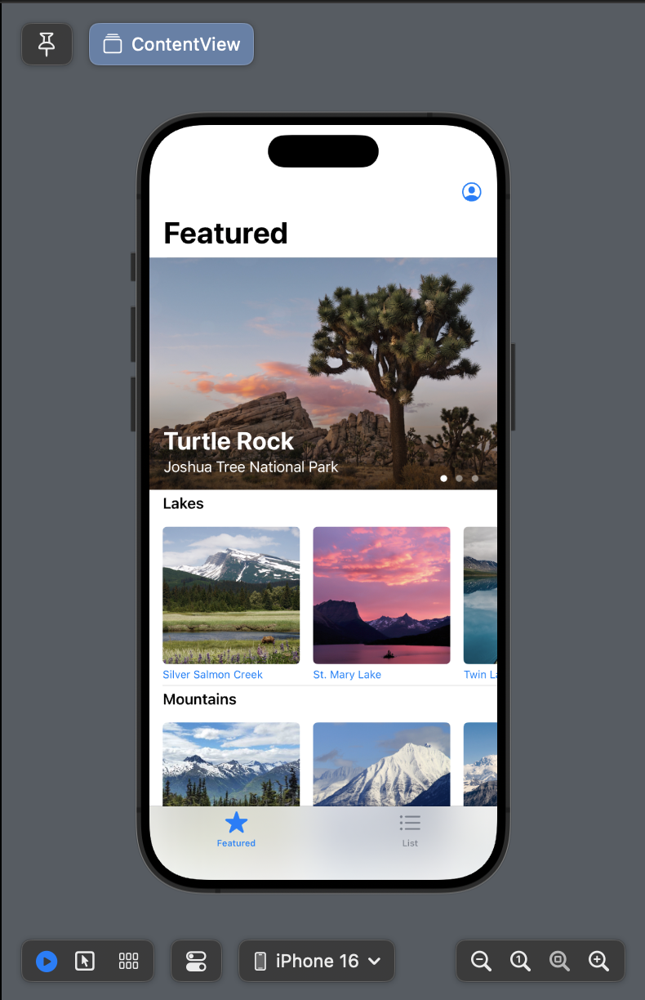
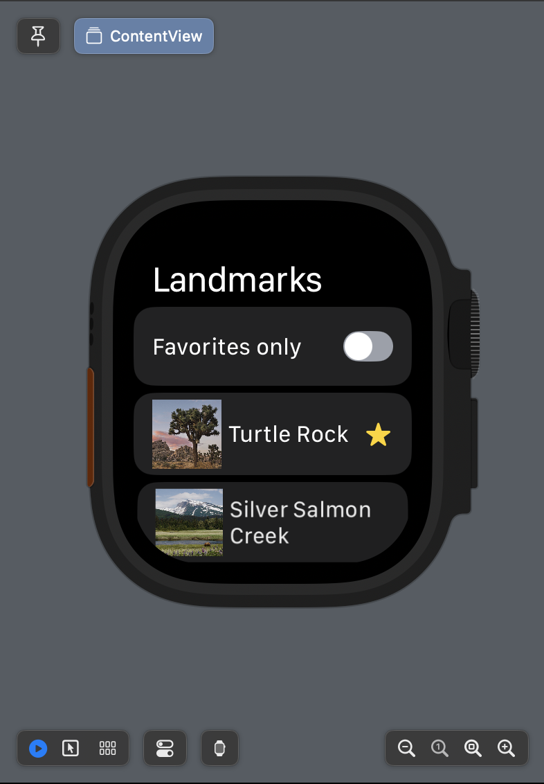

# SwiftUI Example Application

It's made by following [the official Apple tutorial](https://developer.apple.com/tutorials/swiftui/).

SwiftUI is a modern way to declare user interfaces for any Apple platform.

